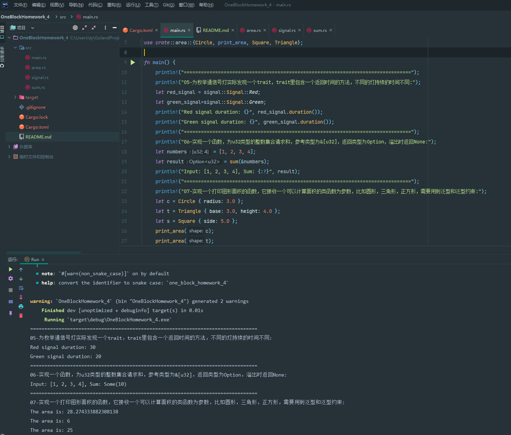

# Substrate入门课程第四课作业
### 作业要求
为枚举通信号灯实际发现一个trait，trait里包含一个返回时间的方法，不同的灯持续的时间不同；

实现一个函数，为u32类型的整数集合请求和，参考类型为&[u32]，返回类型为Option，溢出时返回None；

实现一个打印图形面积的函数，它接收一个可以计算面积的类函数为参数，比如圆形，三角形，正方形，需要用到泛型和泛型约束。

### 作业代码
为枚举通信号灯实际发现一个trait，trait里包含一个返回时间的方法，不同的灯持续的时间不同：

#### [src/signal](src/signal.rs)

实现一个函数，为u32类型的整数集合请求和，参考类型为&[u32]，返回类型为Option，溢出时返回None；

#### [src/sum](src/sum.rs)

实现一个打印图形面积的函数，它接收一个可以计算面积的类函数为参数，比如圆形，三角形，正方形，需要用到泛型和泛型约束。

#### [src/area](src/area.rs)

main函数

#### [src/main](src/main.rs)

### 作业运行截图

